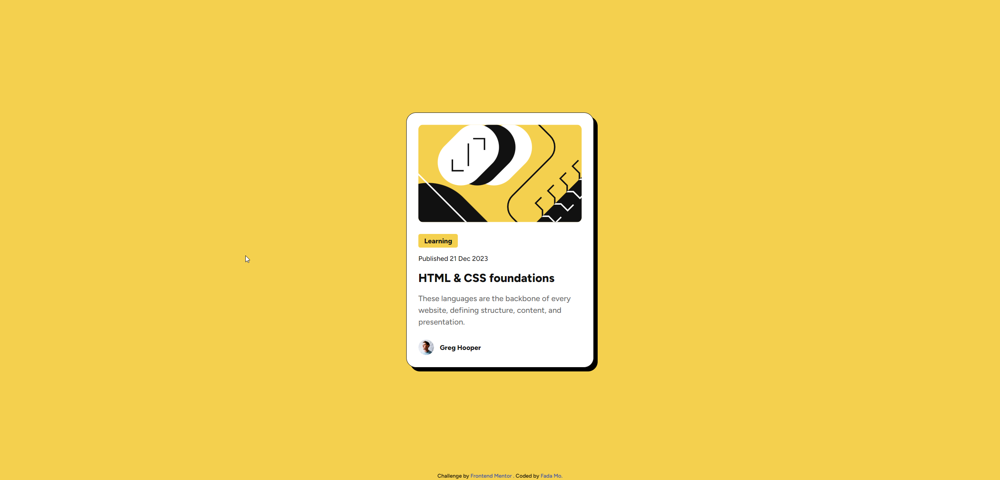
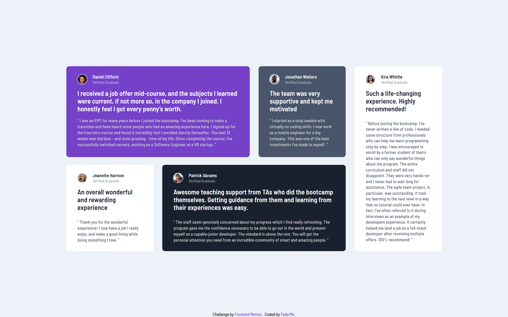
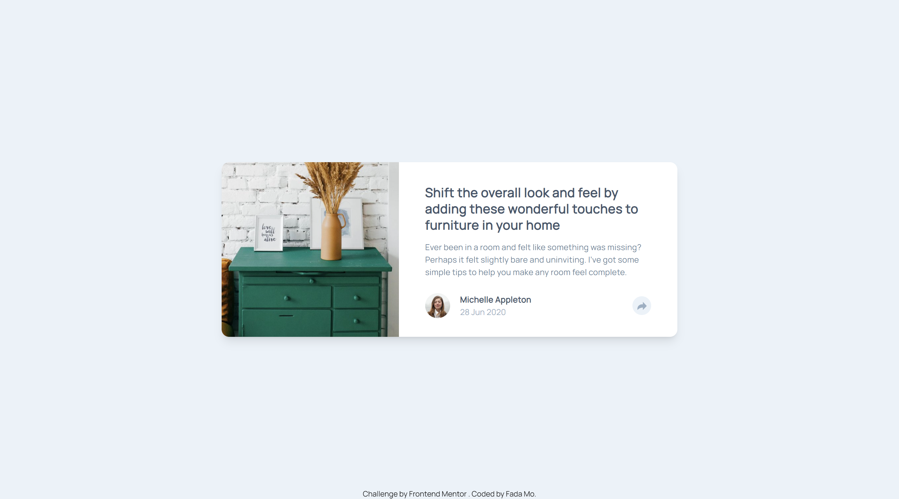
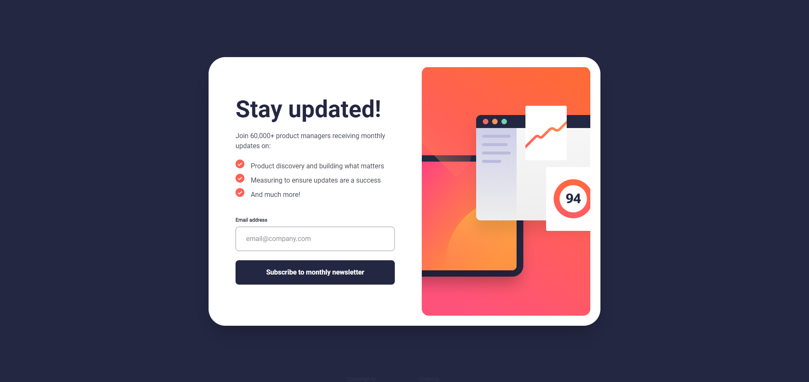
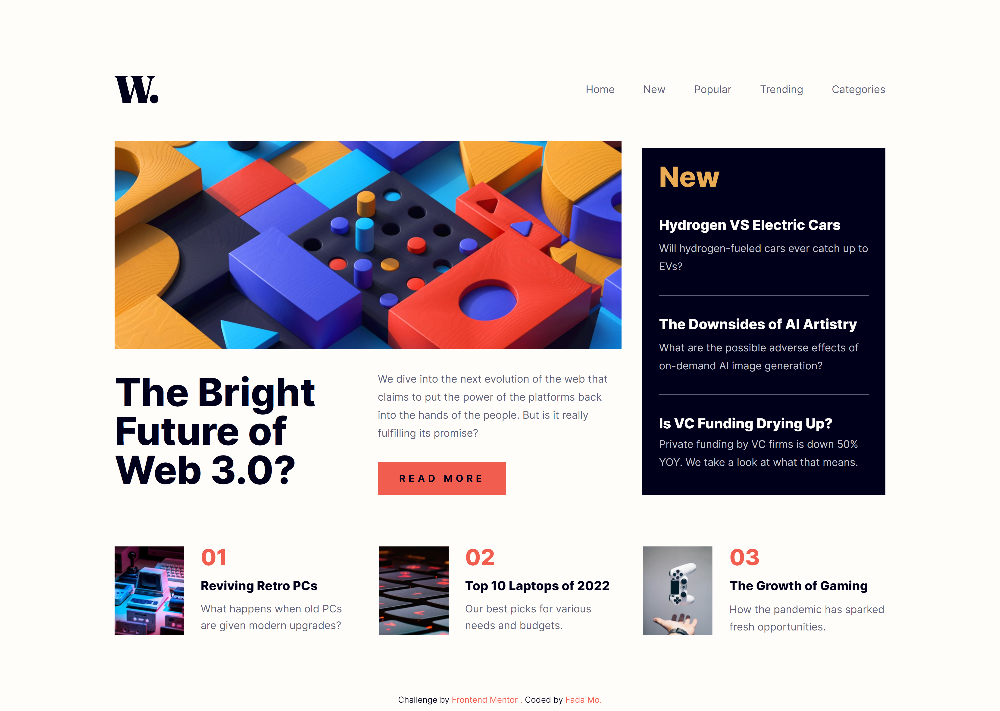

  

<h1>Frontend Mentor - 挑战</h1>

[English](README.md) · 中文

## 欢迎! 👋

这是Frontend Mentor的挑战，我把所有的项目都合并在一起了，否则的话我需要创建太多的库，我觉得这样好看一点

## 我为什么会参加挑战

我参加挑战是为了提高技能和学习新知识。我还希望能够参与真正的项目并能够与团队合作。

我最近在学习tailwind css，我认为这是一个很不错的项目，过去我更喜欢把css写在一起，初次接触tailwind
css让我很困惑。

我很难接受这种写法，但慢慢的我尝试去接受它，我发现还是很不错的，就像大家常说的：质疑tailwind，理解tailwind，使用tailwind，成为tailwind
，超越tailwind(what? 我不认为自己能超威)

## 概览

### 1. [二维码组件](challenges/qr-code-component)

[在线预览](https://mofada.github.io/frontend-mentor/challenges/qr-code-component/)

### 2. [博客预览卡片](challenges/blog-preview-card)

[在线预览](https://mofada.github.io/frontend-mentor/challenges/blog-preview-card/)

### 3. [社交媒体主页](challenges/social-links-profile)

[在线预览](https://mofada.github.io/frontend-mentor/challenges/social-links-profile/)

### 4. [食谱页面](challenges/recipe-page)

[在线预览](https://mofada.github.io/frontend-mentor/challenges/recipe-page/)

### 5. [产品预览卡片](challenges/product-preview-card-component)

[在线预览](https://mofada.github.io/frontend-mentor/challenges/product-preview-card-component/)

### 6. [四卡功能区](challenges/four-card-feature-section)

[在线预览](https://mofada.github.io/frontend-mentor/challenges/four-card-feature-section/)

### 7. [见证网格部分](challenges/testimonials-grid-section)

[在线预览](https://mofada.github.io/frontend-mentor/challenges/testimonials-grid-section/)

### 8. [文章预览组件](challenges/article-preview-component)

[在线预览](https://mofada.github.io/frontend-mentor/challenges/article-preview-component/)

### 9. [时事通讯注册成功消息](challenges/newsletter-sign-up-with-success-message)

[在线预览](https://mofada.github.io/frontend-mentor/challenges/newsletter-sign-up-with-success-message/)

### 9. [时间跟踪仪表板](challenges/time-tracking-dashboard)

[在线预览](https://mofada.github.io/frontend-mentor/challenges/time-tracking-dashboard/)

### 10. [小费计算器应用程序](challenges/tip-calculator-app)

[在线预览](https://mofada.github.io/frontend-mentor/challenges/time-tracking-dashboard/)

### 11. [互动评级组件](challenges/interactive-rating-component)

[在线预览](https://mofada.github.io/frontend-mentor/challenges/interactive-rating-component/)

### 12. [常见问题-手风琴](challenges/faq-accordion)

[在线预览](https://mofada.github.io/frontend-mentor/challenges/faq-accordion/)

### 13. [联系表单](challenges/contact-form)

[在线预览](https://mofada.github.io/frontend-mentor/challenges/contact-form/)

### 14. [新闻首页](challenges/news-homepage)

[在线预览](https://mofada.github.io/frontend-mentor/challenges/news-homepage/)

正在开发中...

## 作者

- Frontend Mentor - [@mofada](https://www.frontendmentor.io/profile/mofada)
- Twitter - [@im_mofada](https://x.com/im_mofada)
