

  

<h1>Frontend Mentor - Challenges</h1>

English · [中文](README-zh_CN.md)

## Welcome! 👋

This is a Frontend Mentor challenge. I merged all the projects together, otherwise I would have to
create too many libraries. I think it looks better this way.

## Why I join the challenge

I joined the challenge to improve my skills and to learn new things. I also want to be able to work
on real projects and to be able to work with a team.

I'm learning tailwind css recently. I think it's a very good project. In the past, I preferred to
write CSS together. The first time I came into contact with tailwind css made me confused.

It was difficult for me to accept this writing method, but slowly I tried to accept it. I found
it was still very good. As everyone often says: question tailwind, understand tailwind, use
tailwind, become tailwind, surpass tailwind (what? I don't think I can surpass tailwind)

## Overview

### 1. [Qr Code Component](challenges/qr-code-component)

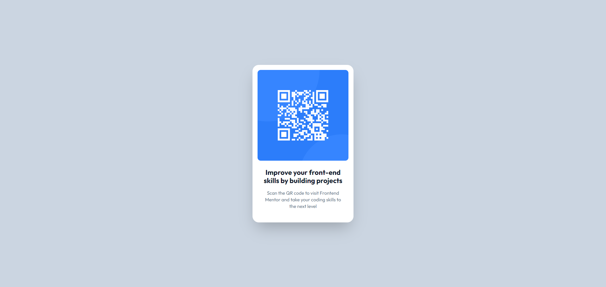

[Preview](https://mofada.github.io/frontend-mentor/challenges/qr-code-component/)

### 2. [Blog preview card](challenges/blog-preview-card)

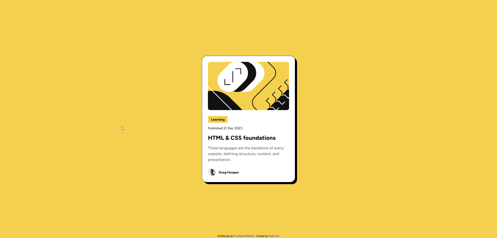

[Preview](https://mofada.github.io/frontend-mentor/challenges/blog-preview-card/)

### 3. [Social links profile](challenges/social-links-profile)

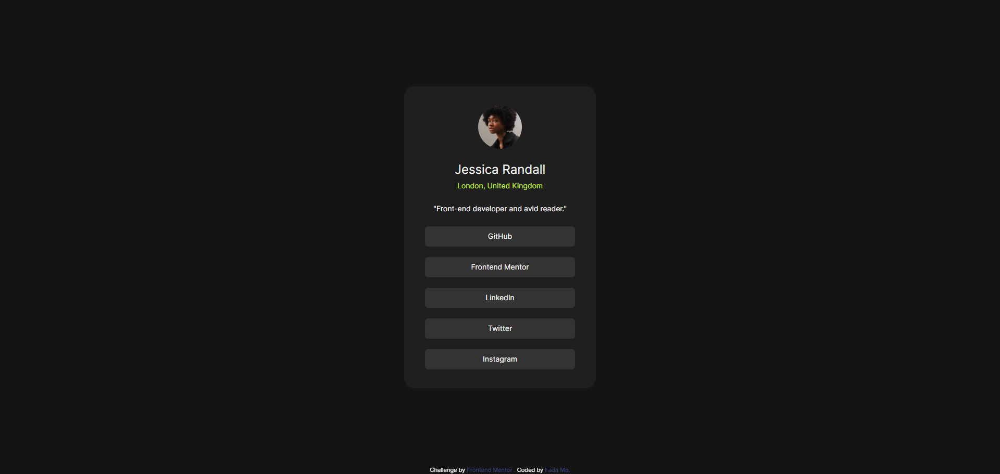

[Preview](https://mofada.github.io/frontend-mentor/challenges/social-links-profile/)

### 4. [Recipe page](challenges/recipe-page)

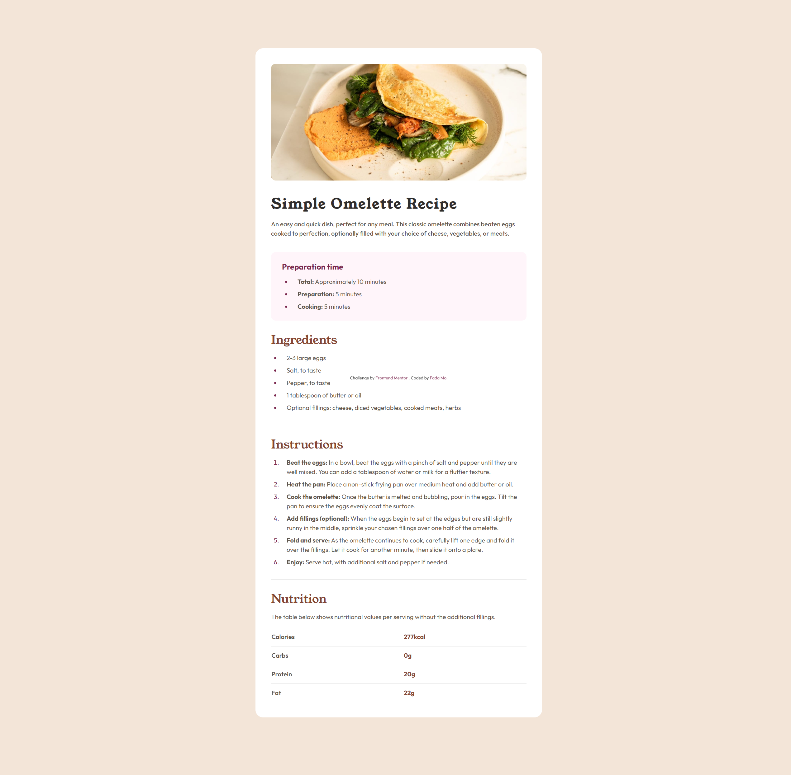

[Preview](https://mofada.github.io/frontend-mentor/challenges/recipe-page/)

### 5. [Product preview card component](challenges/product-preview-card-component)

[Preview](https://mofada.github.io/frontend-mentor/challenges/product-preview-card-component/)

### 6. [Four card feature section](challenges/four-card-feature-section)

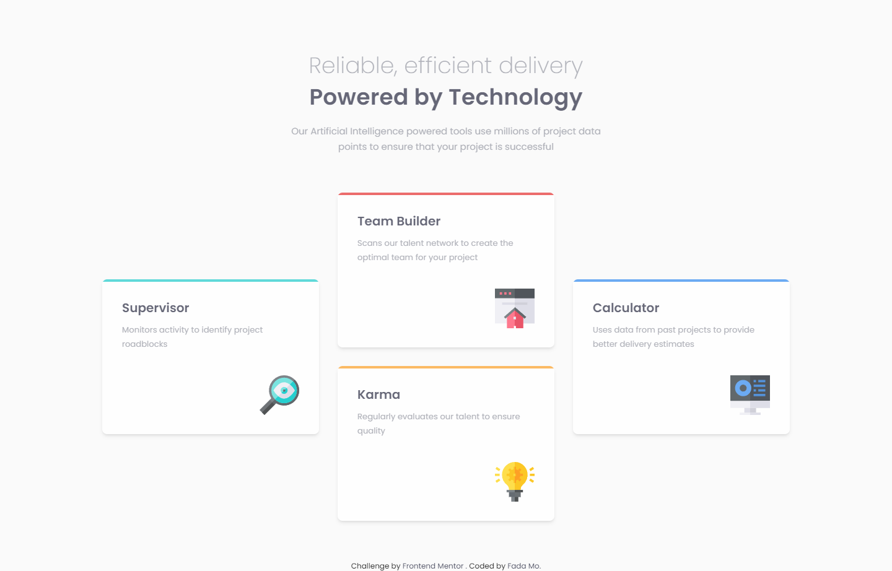

[Preview](https://mofada.github.io/frontend-mentor/challenges/four-card-feature-section/)

### 7. [Testimonials grid section](challenges/testimonials-grid-section)

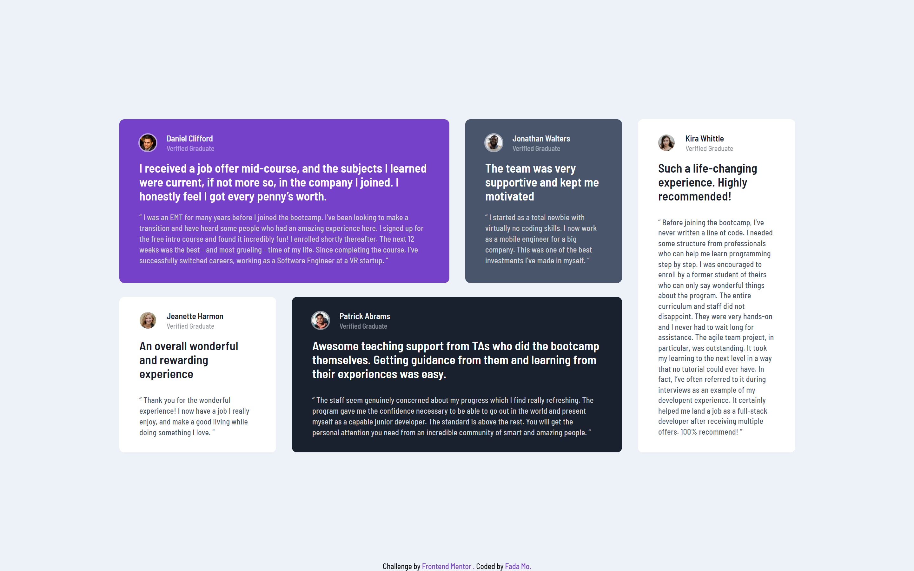

[Preview](https://mofada.github.io/frontend-mentor/challenges/testimonials-grid-section/)

### 8. [article-preview-component](challenges/article-preview-component)

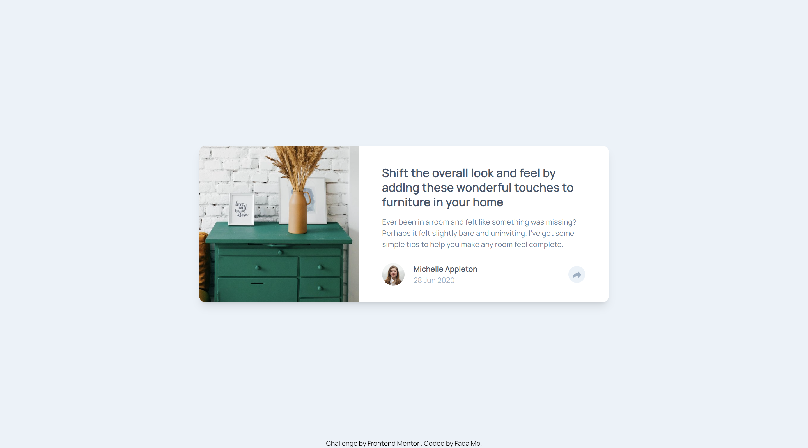

[Preview](https://mofada.github.io/frontend-mentor/challenges/article-preview-component/)

### 9. [newsletter-sign-up-with-success-message](challenges/newsletter-sign-up-with-success-message)

[Preview](https://mofada.github.io/frontend-mentor/challenges/newsletter-sign-up-with-success-message/)

### 9. [time-tracking-dashboard](challenges/time-tracking-dashboard)

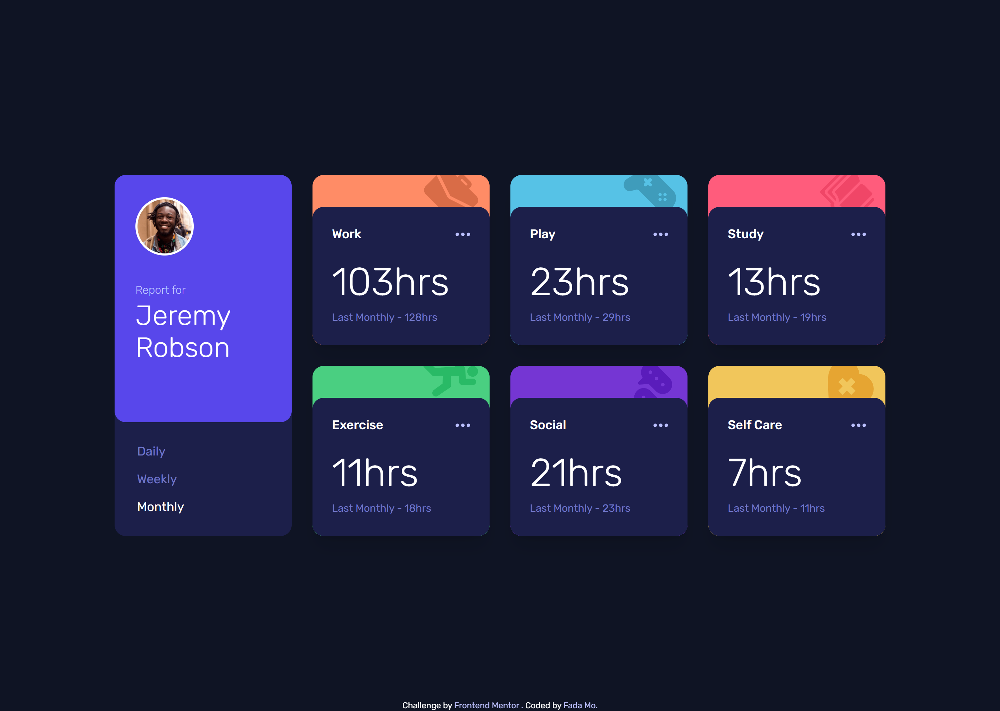

[Preview](https://mofada.github.io/frontend-mentor/challenges/time-tracking-dashboard/)

### 10. [tip-calculator-app](challenges/tip-calculator-app)

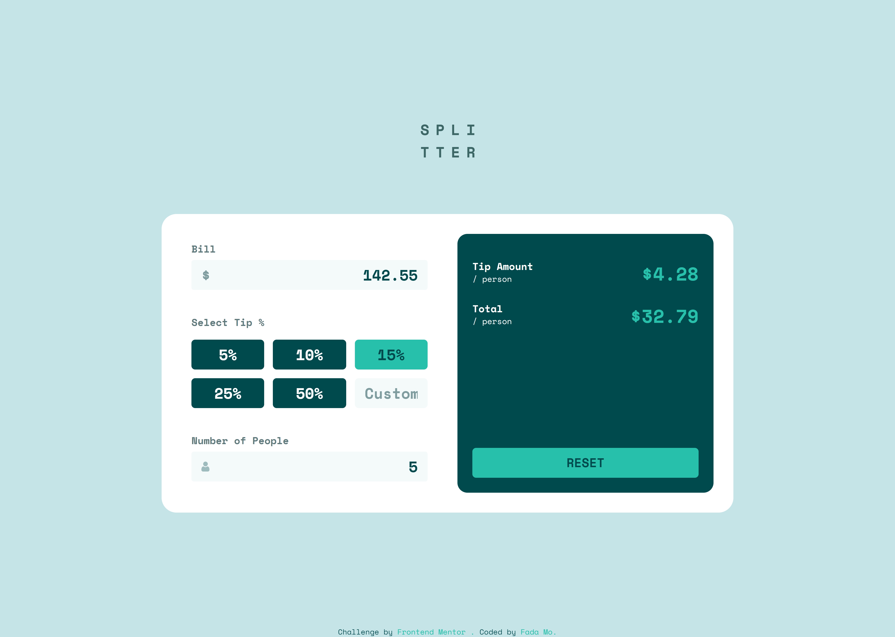

[Preview](https://mofada.github.io/frontend-mentor/challenges/time-tracking-dashboard/)

### 11. [interactive-rating-component](challenges/interactive-rating-component)

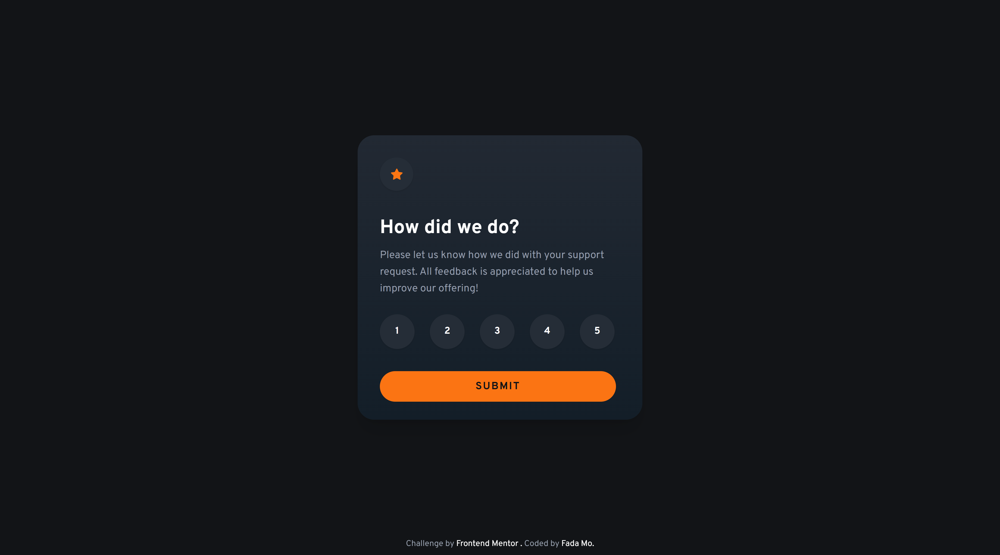

[Preview](https://mofada.github.io/frontend-mentor/challenges/interactive-rating-component/)

### 12. [faq-accordion](challenges/faq-accordion)

[Preview](https://mofada.github.io/frontend-mentor/challenges/faq-accordion/)

### 13. [contact-form](challenges/contact-form)

[Preview](https://mofada.github.io/frontend-mentor/challenges/contact-form/)

### 14. [news-homepage](challenges/news-homepage)

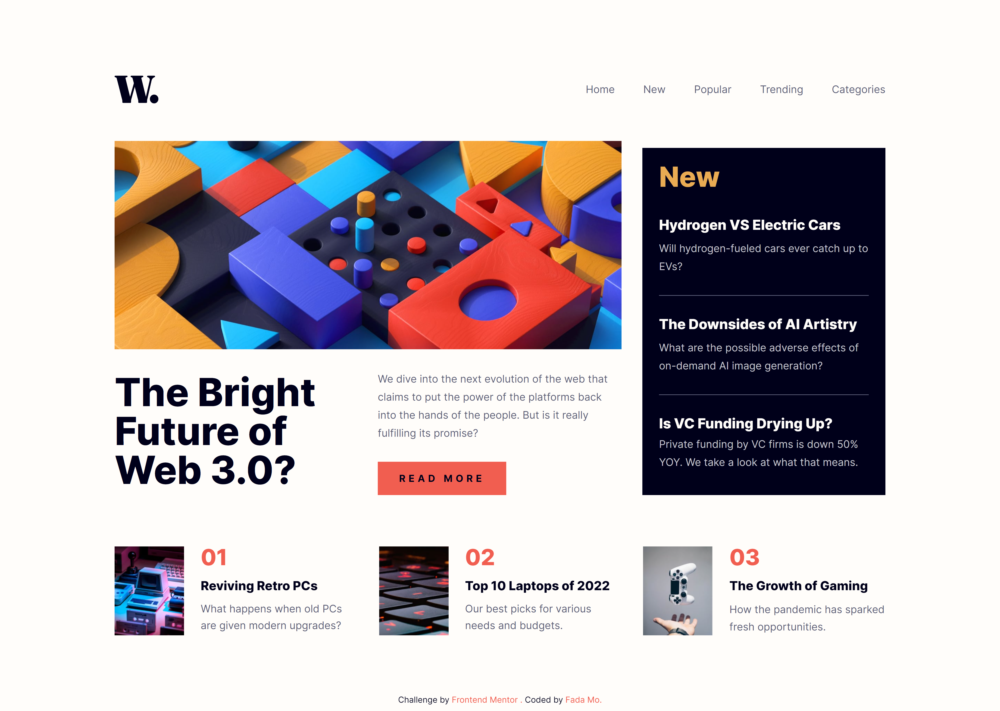

[Preview](https://mofada.github.io/frontend-mentor/challenges/news-homepage/)

### 15. [ecommerce-product-page](challenges/ecommerce-product-page)

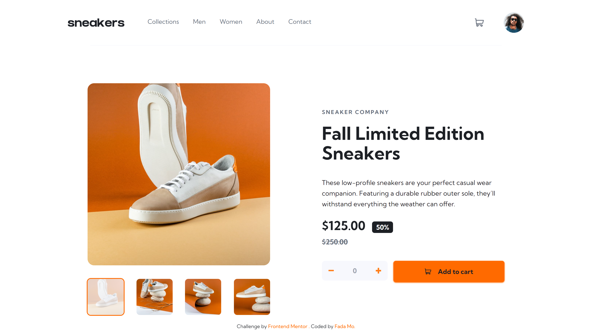

[Preview](https://mofada.github.io/frontend-mentor/challenges/ecommerce-product-page/)

still working...

## Author

- Frontend Mentor - [@mofada](https://www.frontendmentor.io/profile/mofada)
- Twitter - [@im_mofada](https://x.com/im_mofada)
