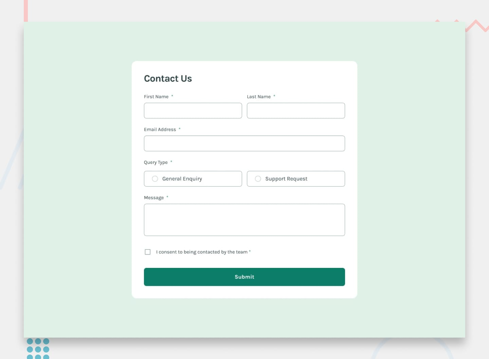
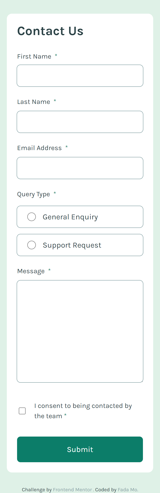

# Frontend Mentor - Contact form solution

This is a solution to
the [Contact form challenge on Frontend Mentor](https://www.frontendmentor.io/challenges/contact-form--G-hYlqKJj).
Frontend Mentor challenges help you improve your coding skills by building realistic projects.

## Table of contents

- [Overview](#overview)
    - [The challenge](#the-challenge)
    - [Screenshot](#screenshot)
    - [Links](#links)
- [My process](#my-process)
    - [Built with](#built-with)
    - [What I learned](#what-i-learned)
    - [Continued development](#continued-development)
    - [Useful resources](#useful-resources)
- [Author](#author)
- [Acknowledgments](#acknowledgments)

**Note: Delete this note and update the table of contents based on what sections you keep.**

## Overview

### The challenge

Users should be able to:

- Complete the form and see a success toast message upon successful submission
- Receive form validation messages if:
    - A required field has been missed
    - The email address is not formatted correctly
- Complete the form only using their keyboard
- Have inputs, error messages, and the success message announced on their screen reader
- View the optimal layout for the interface depending on their device's screen size
- See hover and focus states for all interactive elements on the page

### Screenshot

### Links

- Solution URL: [contact-form]()
- Live Site URL: [contact-form](https://mofada.github.io/frontend-mentor/challenges/contact-form/)

## My process

### Built with

- Semantic HTML5 markup
- CSS custom properties
- Flexbox
- CSS Grid
- Mobile-first workflow
- [Tailwind css](https://tailwindui.com/) - For styles

### What I learned

### Continued development

### Useful resources

- [Building accessible forms](https://www.frontendmentor.io/learning-paths/introduction-to-web-accessibility-mXu-9PHVsd/steps/66bc6d9f3c19191dc3df72ff/article/read) -
  This helped me for form accessibility. 
- [ValidityState](https://developer.mozilla.org/zh-CN/docs/Web/API/ValidityState) - This helped me
  for form validation.

## Author

- Website - [mofada](https://mofada.github.io/frontend-mentor/)
- Frontend Mentor - [@mofada](https://www.frontendmentor.io/profile/mofada)
- Twitter - [@im_mofada](https://x.com/im_mofada)
