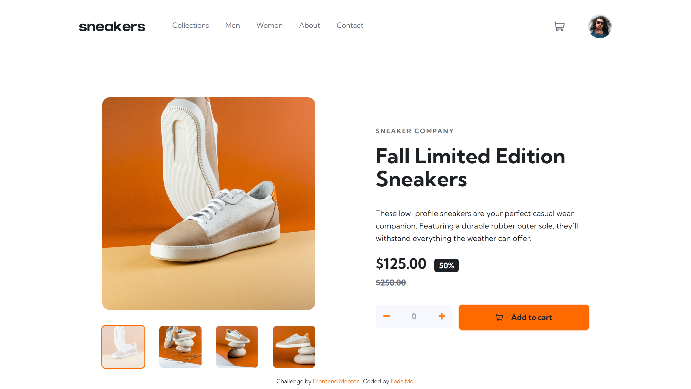

# Frontend Mentor - E-commerce product page

## Table of contents

- [Overview](#overview)
    - [The challenge](#the-challenge)
    - [Screenshot](#screenshot)
    - [Links](#links)
- [My process](#my-process)
    - [Built with](#built-with)
    - [What I learned](#what-i-learned)
    - [Continued development](#continued-development)
    - [Useful resources](#useful-resources)
- [Author](#author)
- [Acknowledgments](#acknowledgments)

## Overview

### The challenge

Users should be able to:

- View the optimal layout for the site depending on their device's screen size
- See hover states for all interactive elements on the page
- Open a lightbox gallery by clicking on the large product image
- Switch the large product image by clicking on the small thumbnail images
- Add items to the cart
- View the cart and remove items from it

### Screenshot

### Links

- Solution URL: [ecommerce-product-page]()
- Live Site URL: [ecommerce-product-page](https://mofada.github.io/frontend-mentor/challenges/ecommerce-product-page/)

## My process

### Built with

- Semantic HTML5 markup
- CSS custom properties
- Flexbox
- CSS Grid
- Mobile-first workflow
- [Tailwind css](https://tailwindui.com/) - For styles

### What I learned

### Continued development

### Useful resources
- [Create a Responsive Hamburger Menu with HTML and CSS](https://medium.com/@mukundkumra.io/create-a-responsive-hamburger-menu-with-html-and-css-a-step-by-step-tutorial-c63e44fcee2e) - Helped me for hamburger menu.
- [Mobile Nav](https://codepen.io/shieldsma91/pen/zLpbLX) - Helped me for hamburger menu.

## Author

- Website - [mofada](https://mofada.github.io/frontend-mentor/)
- Frontend Mentor - [@mofada](https://www.frontendmentor.io/profile/mofada)
- Twitter - [@im_mofada](https://x.com/im_mofada)
