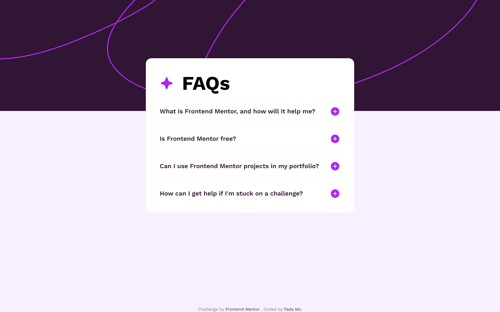

# Frontend Mentor - FAQ accordion

## Table of contents

- [Overview](#overview)
    - [The challenge](#the-challenge)
    - [Screenshot](#screenshot)
    - [Links](#links)
- [My process](#my-process)
    - [Built with](#built-with)
    - [What I learned](#what-i-learned)
    - [Continued development](#continued-development)
    - [Useful resources](#useful-resources)
- [Author](#author)
- [Acknowledgments](#acknowledgments)

## Overview

### The challenge

Users should be able to:

- Hide/Show the answer to a question when the question is clicked
- Navigate the questions and hide/show answers using keyboard navigation alone
- View the optimal layout for the interface depending on their device's screen size
- See hover and focus states for all interactive elements on the page

### Screenshot

### Question

### Links

- Solution URL: [faq-accordion]()
- Live Site URL: [faq-accordion](https://mofada.github.io/frontend-mentor/challenges/faq-accordion/)

## My process

### Built with

- Semantic HTML5 markup
- CSS custom properties
- Flexbox
- CSS Grid
- Mobile-first workflow
- Tailwind css - For styles

### Useful resources

- [20 Simple Ways to Style the HTML details Element](https://www.sitepoint.com/style-html-details-element/) - This helped me for learn `details` tag.
- [details](https://developer.mozilla.org/en-US/docs/Web/HTML/Element/details).  
- [summary](https://developer.mozilla.org/en-US/docs/Web/HTML/Element/summary).
- [Details and summary](https://web.dev/learn/html/details?hl=zh-cn).

## Author

- Frontend Mentor - [@mofada](https://www.frontendmentor.io/profile/mofada)
- Twitter - [@im_mofada](https://x.com/im_mofada)
