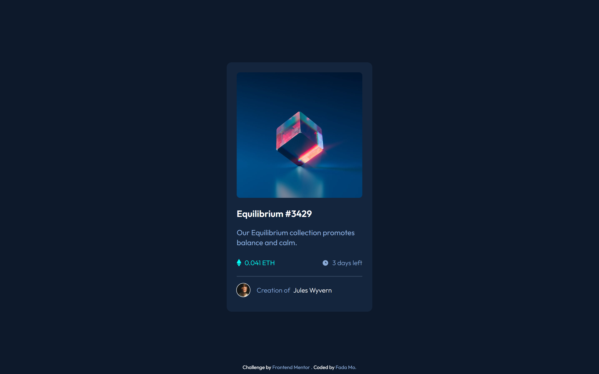
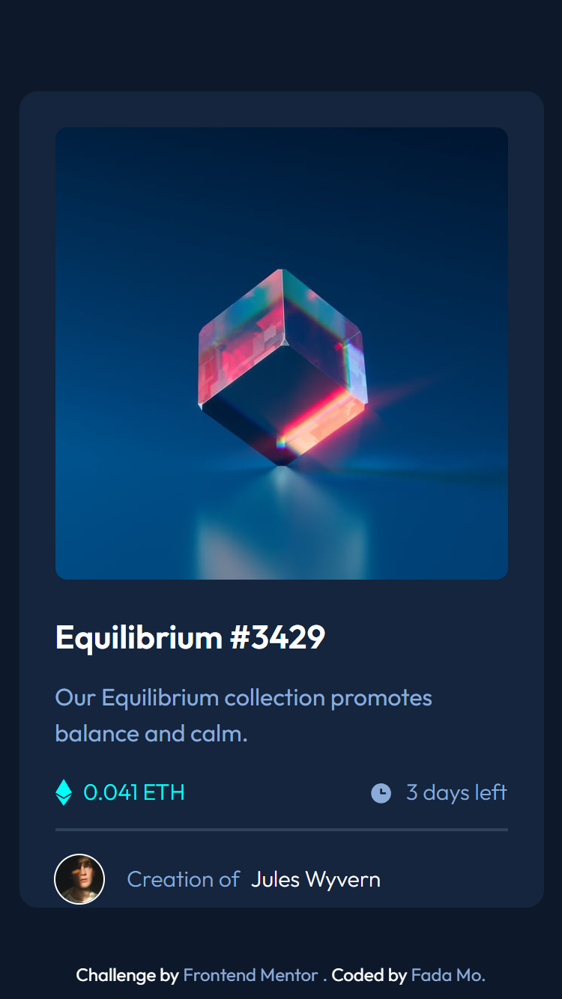

# Frontend Mentor - NFT preview card component

## Table of contents

- [Overview](#overview)
    - [The challenge](#the-challenge)
    - [Screenshot](#screenshot)
    - [Links](#links)
- [My process](#my-process)
    - [Built with](#built-with)
    - [What I learned](#what-i-learned)
    - [Continued development](#continued-development)
    - [Useful resources](#useful-resources)
- [Author](#author)
- [Acknowledgments](#acknowledgments)

## Overview

### The challenge

Users should be able to:

- View the optimal layout depending on their device's screen size
- See hover states for interactive elements

### Screenshot

### Screenshot

### Links

- Solution URL: [nft-preview-card-component]()
- Live Site URL: [nft-preview-card-component](https://mofada.github.io/frontend-mentor/challenges/nft-preview-card-component/)

## My process

### Built with

- Semantic HTML5 markup
- CSS custom properties
- Flexbox
- CSS Grid
- [Tailwind css](https://tailwindui.com/) - For styles

### What I learned

### Continued development

### Useful resources

## Author

- Website - [mofada](https://mofada.github.io/frontend-mentor/)
- Frontend Mentor - [@mofada](https://www.frontendmentor.io/profile/mofada)
- Twitter - [@im_mofada](https://x.com/im_mofada)
