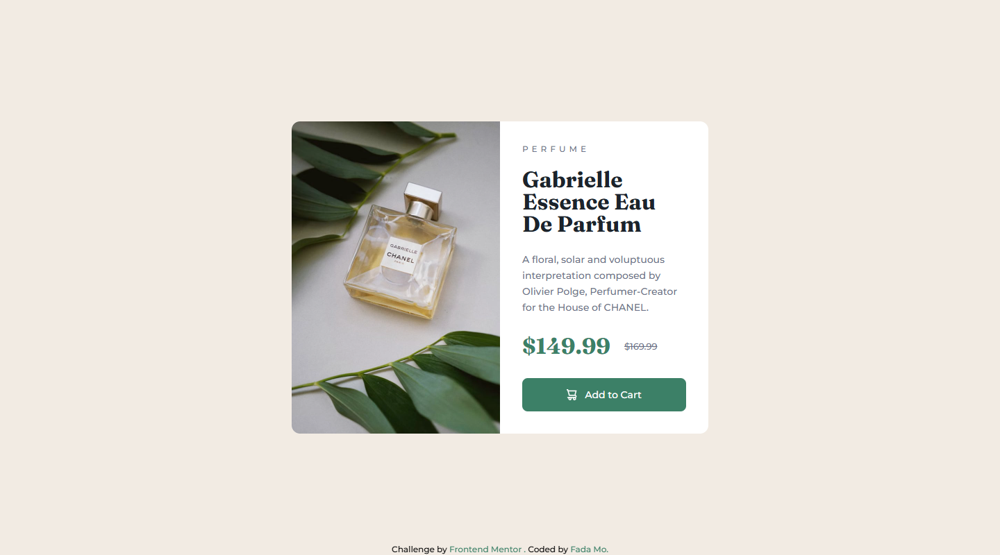

# Frontend Mentor - Product preview card component


## Overview

### Screenshot




### Question 

### Links

- Solution URL: [product-preview-card-with-90-reducibility](https://www.frontendmentor.io/solutions/product-preview-card-with-90-reducibility-c4tH02KHdg)
- Live Site URL: [product-preview-card-component](https://mofada.github.io/frontend-mentor/challenges/product-preview-card-component/)

## Author

- Frontend Mentor - [@mofada](https://www.frontendmentor.io/profile/mofada)
- Twitter - [@im_mofada](https://x.com/im_mofada)


### how to set line-through and offset it?
I carefully observed the UI draft and found that this line is offset. Is there any way to add an offset to the line-through?

Yes, I find a css property `text-decoration-skip-ink` can do this. set 
`text-decoration-skip-ink: none;` and `text-underline-offset: -4px;` to the element. Of course, 
you need to set `text-decoration: underline;` to the element.

```html
<del class="text-[13px] text-dark-grayish-blue">$169.99</del>

```
